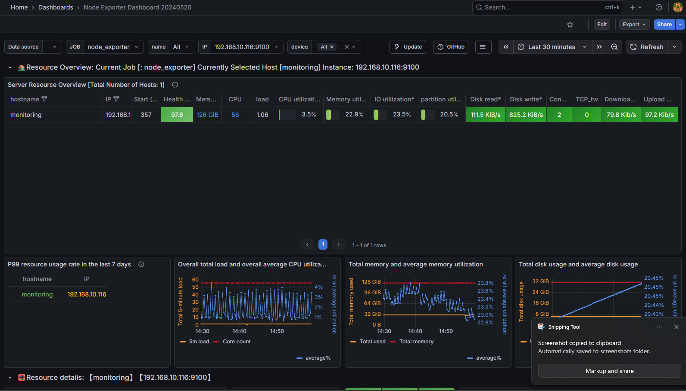

# 📊 Node Exporter Dashboard — English Version

This repository contains an English‑translated version of the original **Node Exporter Dashboard (ID: 8919)** from Grafana.  
The goal is to provide a clean, accurate, and fully localized dashboard while preserving the original layout, metrics, and visualization logic.

> Original dashboard: https://grafana.com/grafana/dashboards/8919-node-exporter-dashboard-20240520-tensuns

---

## 🖼️ Dashboard Preview

---

## ✨ Features
- Fully translated panel titles, labels, and metric descriptions  
- Preserved structure and visual consistency with the original dashboard  
- Compatible with **Prometheus + node_exporter**  
- Clean wording for better clarity in English environments  
- Easy import into any Grafana instance  

---

## 📥 Installation

1. Download the JSON file from this repository  
2. Open **Grafana → Dashboards → Import**  
3. Upload the JSON file  
4. Select your Prometheus datasource  
5. Done!

---

## 🔧 Requirements
- **Grafana** 8+  
- **Prometheus**  
- **node_exporter** installed on monitored hosts  

---

## 🙌 Contributions
Any help improving the translation or adding enhancements is welcome.  
Feel free to open issues or submit pull requests.
